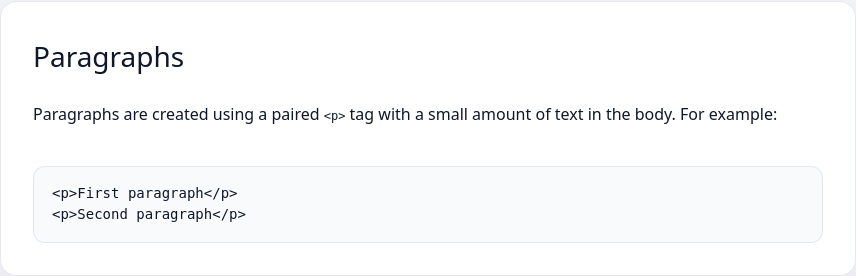
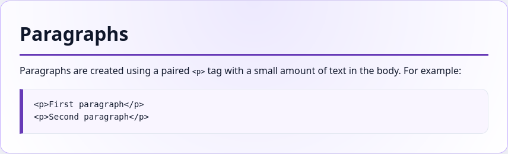

En el curso dedicado al lenguaje de marcado HTML, se estudiaron varios elementos que, por defecto, tienen estilos aplicados: los párrafos tenían sangría, los enlaces tenían un color diferente, los títulos diferían en el tamaño de letra, etc. Como desarrollador, puedes cambiar estos estilos y agregar unos completamente nuevos. ¿Agregar un fondo al texto? ¿Cambiar el tamaño de los elementos? ¿Crear animaciones? Todo esto se puede hacer con CSS (Hojas de estilo en cascada), un lenguaje que define cómo se verán los elementos HTML en el navegador.

El curso de CSS es una continuación lógica del [curso de HTML](https://ru.code-basics.com/languages/html). Muchas etiquetas y conceptos que se encontrarán durante el curso ya fueron explicados.

El siguiente ejemplo muestra cómo se ve el texto sin usar CSS personalizado (es decir, se aplican los estilos que el navegador "define") y cómo se puede estilizar el documento utilizando CSS.

## Ejemplo de texto con estilo estandartizado

```html
<p class="h2">Paragraphs</p>
<p>Paragraphs are created using a paired <code>&lt;p&gt;</code> tag with a small amount of text in the body. For example:</p>
<pre><code>&lt;p&gt;First paragraph&lt;/p&gt;
&lt;p&gt;Second paragraph&lt;/p&gt;</code></pre>
```



## Ejemplo de texto con estilo personalizado

```html
<p class="border-bottom display-6 pb-2">Paragraphs</p>
<p class="lead">Paragraphs are created using a paired <code>&lt;p&gt;</code> tag with a small amount of text in the body. For example:</p>
<pre class="bg-light my-4" style="border-left: 5px solid #673ab7!important;"><code>&lt;p&gt;First paragraph&lt;/p&gt;
&lt;p&gt;Second paragraph&lt;/p&gt;</code></pre>
```



Ahora el texto es más legible y se puede diferenciar rápidamente los ejemplos de código de las descripciones. En el curso se explicarán las reglas básicas de CSS para trabajar con texto y bloques, lo que permitirá dar formato al texto y estructurar visualmente la información.
