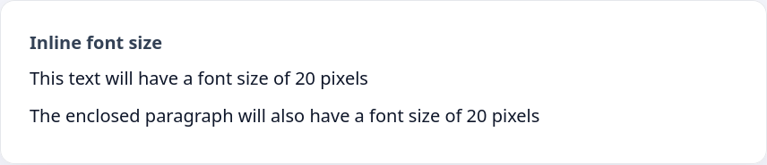
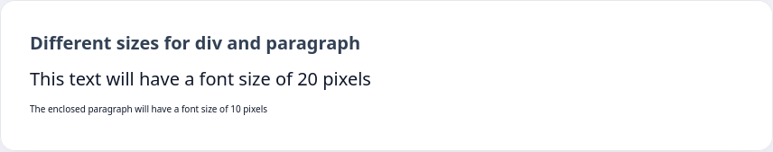

Основная проблема использования атрибутов для определения стилей — их перегруженность. Часто разметка HTML содержит очень много элементов, а с добавлением стилей кода становится намного больше, что плохо сказывается на чтении разметки.

Вторая проблема — исправление стилей. Для этого необходимо сначала найти нужный элемент в коде, а потом отредактировать его стили. Таких элементов на странице может быть 10, 20, 100. А для одноимённых тегов придётся записывать стили отдельно для каждого элемента.

Возникает естественное желание иметь все стили в одном месте, где можно было бы их быстро редактировать. Таким решением является использование тега `<style>`, внутри которого могут располагаться все необходимые стили.

Возьмём пример из прошлого урока:

```html
<div style="font-size: 20px;">
  This text will have a font size of 20 pixels

  <p>The enclosed paragraph will also have a font size of 20 pixels</p>
</div>
```



Чтобы избавиться от атрибутов, добавим тег `style` и укажем, что для тега `<div>` используется шрифт размером в 20 пикселей.

```html
<style>
  div {
    font-size: 20px;
  }
</style>

<div>
  This text will have a font size of 20 pixels

  <p>The enclosed paragraph will also have a font size of 20 pixels</p>
</div>
```


Таким же образом можно указать, что у параграфа будет размер шрифта 10 пикселей.

```html
<style>
  div {
    font-size: 20px;
  }

  p {
    font-size: 10px;
  }
</style>

<div>
  This text will have a font size of 20 pixels

  <p>The enclosed paragraph will have a font size of 10 pixels</p>
</div>
```



Внутри тега `<style>` использовалась конструкция вида:

```text
tag_name {
  property: value;
}
```

Всё, что было записано до открывающей скобки `{` называется _селектор_. Селекторы — правила, по которым браузер определяет к какому элементу нужно добавить стили. С некоторыми из селекторов мы познакомимся чуть позже. В примерах выше используются селекторы по тегу, то есть стили будут применяться ко всем элементам с тегом, указанном в качестве селектора

```css
/* All div elements will have a font size of 20px */
div {
  font-size: 20px;
}
```
