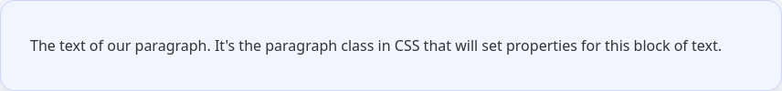

Основное решение для стилизации конкретного участка страницы — использование классов. Они помогают задать нужный нам стиль не разом для всех элементов на странице, а только для тех элементов, у которых указан необходимый класс.

Чтобы задать стиль для класса в CSS используется селектор `.название-класса`. Обратите внимание на точку — именно так браузер понимает, что данный стиль указывается для класса.

```html
<p class="paragraph">
  The text of our paragraph.
  It's the paragraph class in CSS that
  will set properties for this block of text.
</p>
```

```css
.paragraph {
  color: #333333;
  /*
    The color property sets the color of the text.
    In this case, it is gray with a value of #333333
  */
}
```

Так как классов с одинаковым именем на странице может быть много, то это правило сработает для всех элементов, у которых атрибут класс равен `paragraph`.


