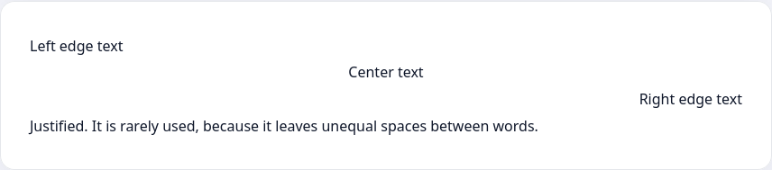

Хороший способ выделить участок текста — выровнять его иначе, чем остальной текст. На многих сайтах используют выравнивание заголовка по центру, чтобы пользователь быстрее мог его отличить.

```html
<p class="text-center h3">Centered header</p>
<p>Page text. You can see that the header jumps out more since it's centered</p>
```


CSS позволяет выровнять текст, используя свойство `text-align` с 4 основными значениями:

* `left` — по левому краю. Используется по умолчанию
* `center` — по центру
* `right` — по правому краю
* `justify` — по ширине

```html
<p class="left">Текст по левому краю</p>
<p class="center">Текст по центру</p>
<p class="right">Текст по правому краю</p>
<p class="justify">Текст с выравниванием по ширине. Используется редко, так как оставляет неравномерные пробелы между словами</p>
```

```css
.left {
  text-align: left;
}

.center {
  text-align: center;
}

.right {
  text-align: right;
}

.justify {
  text-align: justify;
}
```


