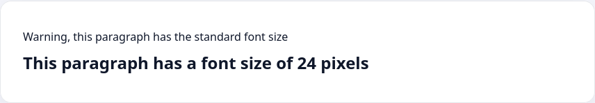

Ещё один способ отделить смысловые участки текста — использование разного размера шрифта. Мы уже встречались с тем, что браузеры стилизуют заголовки по разному. Именно размером текста отделяется заголовок `<h1>` от заголовка `<h2>` и так далее.

Управлять размером текста в CSS можно с помощью свойства `font-size`, которое принимает числовое значение и единицу измерения. Сейчас, в качестве единицы измерения мы будем использовать пиксели, хотя есть ещё несколько важных единиц, которые будут изучены к концу этого курса.

```html
<p>Warning, this paragraph has the standard font size</p>
<p class="warning">This paragraph has a font size of 24 pixels</p>
```

```css
.warning {
  font-size: 24px;
}
```


