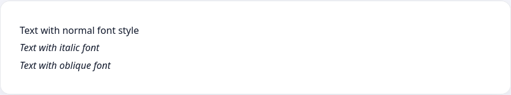

Italic text is often used to emphasize quotations or terms. In contrast to changing thickness, italics allow you to emphasize a section of the text, but not highlight it so that it is immediately more conspicuous.

To change the font style, use the `font-style` property, which can take one of these values:

* `normal` - normal text output.
* `italic` - italic style
* `oblique` - italic style

```html
<p>Text with normal font style</p>
<p class="italic">Text with italic font</p>
<p class="oblique">Text with oblique font</p>
```



Note that the text with a value of `italic` and text with the value set to `oblique` may look exactly the same. So what's the point here? The `italic` value looks for a special italic version of the font, while `oblique` merely systematically tilts the characters in the text. Not all fonts have a separate version for italic, so visually, both values will look the same.

Use `italic` to create italics - this is the most common option

```html
<p class="italic">Italic text</p>
```

```css
.italic {
  font-style: italic;
}
```


