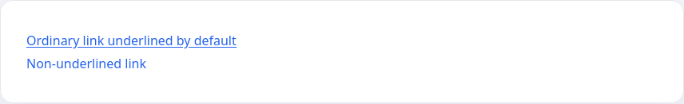

<u>Underlining</u> is often used to boost text. It shows the importance of the current word or text (and it's also often used to show links in a document). Another means of styling text is to use <s>strike-through</s> to show a piece of text that is wrong, e.g., "Don't do this <s>or that</s>."

The `text-decoration` property with three basic properties is used for this kind of text modification:

* `underline` - <u>underline text</u>
* `line-through` - <s>Redraw text</s>
* `overline` - <span style="text-decoration: overline;">overline text</span>

The `none` value is used to remove underscores from links. This is often used to remove the underscore from links, which are there by default

```html
<a href="#">Ordinary link underlined by default</a>
<a href="#" class="text-decoration-none">Non-underlined link</a>
```

```css
.text-decoration-none {
  text-decoration: none;
}
```


