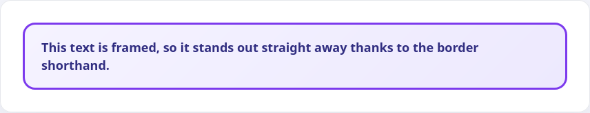
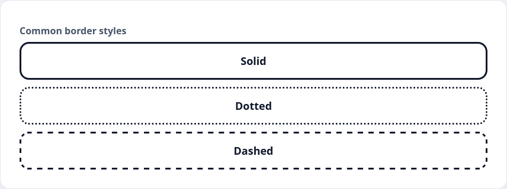

Любой блочный элемент в HTML можно выделять с помощью рамок. Такой стилистический приём позволяет удобно отделить однотонные компоненты друг от друга, или выделить ключевой элемент на странице

```html
<div class="border-card">
  This text is framed, so it's easy to find on the page straight away
</div>
```

```css
.border-card {
  border: 3px solid #673ab7;
  border-radius: 12px;
  padding: 16px 24px;
}
```



Для создания границы у элемента используется свойство `border`, которое является сокращением от нескольких свойств:

* `border-width` — ширина границы
* `border-style` — стиль границы
* `border-color` — цвет границы

Можно указывать несколько свойств, а можно всё объединить в рамках свойства `border`. Такой вариант встречается чаще всего и выглядит он так:

```css
.element {
  border: 1px solid #ccc;
}
```

где:

* `1px` — ширина границы
* `solid` — стиль границы
* `#ccc` — цвет границы

Со значениями в пикселях и hex-цветом мы уже сталкивались в рамках курса, а вот стилей границ в CSS восемь:

* `dotted`
* `dashed`
* `solid`
* `double`
* `groove`
* `ridge`
* `inset`
* `outset`

и есть значение `none`, которое «удалит» границу, так как при значении `border-style: none` браузеры игнорируют другие свойства и удаляют границу

## Примеры границ

```html
<div class="border-sample border-solid">solid</div>
<div class="border-sample border-dotted">dotted</div>
<div class="border-sample border-dashed">dashed</div>
```

```css
.border-sample {
  border-width: 3px;
  border-color: #111;
  padding: 12px 16px;
  margin-bottom: 12px;
  border-radius: 8px;
  text-transform: capitalize;
}

.border-solid {
  border-style: solid;
}

.border-dotted {
  border-style: dotted;
}

.border-dashed {
  border-style: dashed;
}
```


