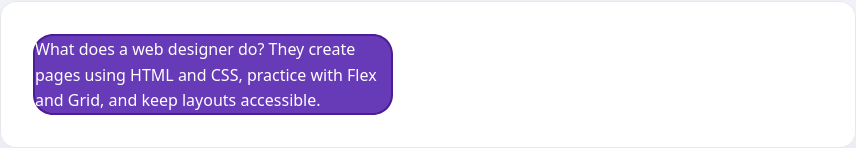
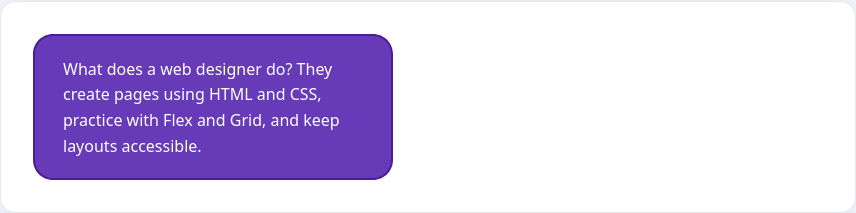

Looking at the various blocks that we've created during our lessons, you'll notice that the text "sticks" to the edges of the blocks. For example:

```html
<div class="card card-tight">A card with white text on a purple background</div>
```

```css
.card {
  color: #ffffff;
  background-color: #673ab7;
}

.card-tight {
  padding: 0;
}
```



You might say that that's not how the examples usually look in the lessons themselves, and you'd be right. In each example, internal indents from the block edges called margins were used to add a little spacing.

Four rules are used to create internal indents:

* `padding-top`
* `padding-right`
* `padding-bottom`
* `padding-left`

Each property takes a numeric value and a unit of measurement, e.g. pixels

```html
<div class="card">A card with white text on a purple background</div>
```

```css
.card {
  padding-top: 10px;
  padding-bottom: 10px;
  padding-left: 20px;

  color: #ffffff;
  background-color: #673ab7;
}
```



## Shortened property

If you want to set indents on all sides, don't use 4 different properties, you only need one - `padding`. This is shorthand for some properties we already know which allows you to set them in the following order:

* top
* right
* bottom
* left

The order in which it is specified is important and corresponds to the order specified above. If you rework the example above, it will look like this:

```css
.card {
  padding: 10px 0 10px 20px

  color: #ffffff;
  background-color: #673ab7;
}
```

In addition to this notation, there are shorthand notations of these rules for convenience:

* If you specify only one value, it will be used simultaneously for all sides
* If you specify two values, the first will be used for vertical (top and bottom) margin and the second for horizontal (right and left) margin
* If you specify three values, they will be used for top, horizontal and bottom margin
