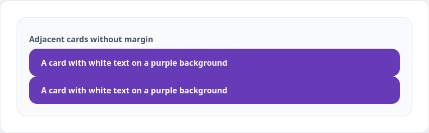
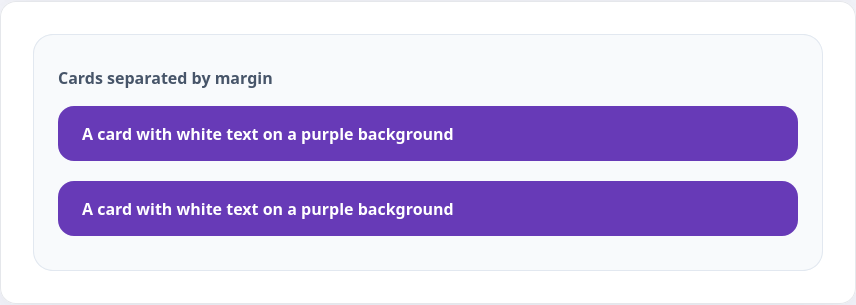

Внутренние отступы позволяли добавить «воздуха» в блок и дать пространство между границей блока и его контентом. А как не дать двум соседним блокам прижиматься друг к другу?

```html
<div class="card card-tight">A card with white text on a purple background</div>
<div class="card card-tight">A card with white text on a purple background</div>
```

```css
.card {
  color: #ffffff;
  background-color: #673ab7;
  padding: 10px 0 10px 20px;
}

.card-tight {
  margin: 0;
}
```



Чтобы отделить две карточки из примера выше используются внешние отступы. Их принцип работы схож с внутренними отступами, а меняется только направление. В плане свойств и их значений всё то же самое. Существует 4 правила и одно общее:

* `margin-top` — внешний отступ сверху
* `margin-right` — внешний отступ справа
* `margin-bottom` — внешний отступ снизу
* `margin-left` — внешний отступ слева

Для объединения значений используют свойство `margin`, в котором сохраняется порядок указания:

* отступ сверху
* отступ справа
* отступ снизу
* отступ слева

Также, как у внутренних отступов, для удобства существуют сокращённые записи этих правил:

* Если указать только одно значение, то оно будет использовано одновременно для всех сторон
* Если указать два значения, то первое будет использоваться для отступов по вертикали (сверху и снизу), а второе по горизонтали (справа и слева)
* Если указать три значения, то они будут использоваться для отступа сверху, по горизонтали и снизу

```html
<div class="card">A card with white text on a purple background</div>
<div class="card">A card with white text on a purple background</div>
```

```css
.card {
  margin: 10px 0;

  color: #ffffff;
  background-color: #673ab7;
}
```


