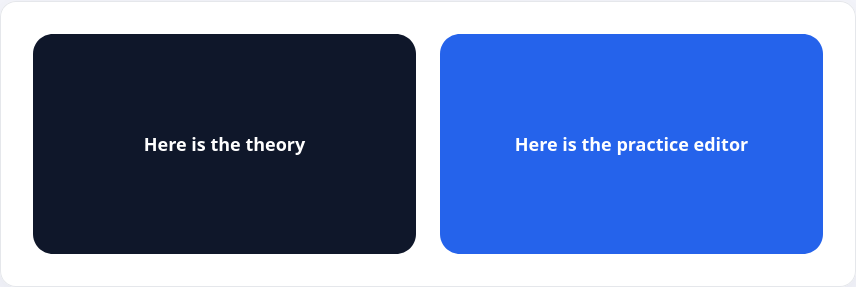

Расположение элементов на странице — одна из важных областей работы верстальщика или фронтенд-разработчика. Во всех прошлых уроках мы добавляли небольшие элементы, но их расположение определялось только тем, как они были добавлены в HTML. Чаще всего это просто расположение сверху вниз.

При верстке страниц разработчику нужно располагать элементы не только таким образом, но и рядом друг с другом.

Взгляните на текущую страницу. В ней есть две большие области, которые расположены рядом друг с другом — это блок с теорией и блок с редактором кода.

Одним из способов решения такой задачи является использование модуля Flex из CSS. Для этого достаточно указать свойство `display` со значением `flex` у общего блока, внутри которого находятся блоки с практикой и теорией.

```html
<style>
.container {
  display: flex;
}
</style>

<div class="container">
  <div class="theory">Here is the theory</div>
  <div class="practice">Here is the practice editor</div>
</div>
```

Для наглядности добавим немного стилей, чтобы увидеть расположение блоков



В текущей верстке блок с классом `container` называется _Flex-контейнер_, а элементы с классами `theory` и `practice` будут называться _Flex-элементами_. Важно, что _flex-элементы_ это только те элементы, которые лежат непосредственно внутри контейнера.

Например,

```html
<style>
.container {
  display: flex;
}
</style>

<div class="container">
  <div class="theory">
    <div class="theory-text">Here is the theory</div>
  </div>
  <div class="practice">
    <div class="vscode">Here is the practice editor</div>
  </div>
</div>
```

В этой разметке flex-элементами будут блоки с классами `theory` и `practice`, но вложенные в них блоки с классами `theory-text` и `vscode` уже не являются flex-элементами. На них не будут действовать правила, которые мы изучим в следующих уроках.
