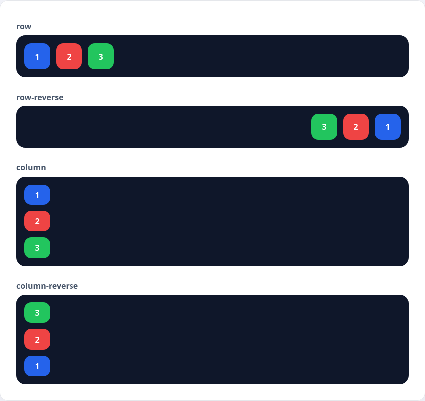

Если немного погрузиться в теорию работы модуля Flex, то станет понятно, что это некая ось, на которую «насаживаются» элементы. Почти как кубики на железку или костяшки на счёты.

Как и в реальном мире, мы можем поворачивать главную ось, чтобы расположить элементы по другому. Для этого используется свойство `flex-direction`, которое может принимать одно из четырех значений:

* `row` — значение по умолчанию. Элементы выстраиваются в линию, в которой первый элемент находится слева
* `row-reverse` — Эффект похож на значение `row`, но элементы выстраиваются в обратном порядке, то есть первый элемент окажется справа
* `column` — элементы выстраиваются сверху вниз. Первый элемент находится сверху
* `column-reverse` — элементы выстраиваются снизу вверх, то есть первый элемент находится внизу

```html
<div class="flex-demo row">
  <div>1</div>
  <div>2</div>
  <div>3</div>
</div>
```

```css
.flex-demo {
  display: flex;
  gap: 12px;
}

.row {
  flex-direction: row;
}

.row-reverse {
  flex-direction: row-reverse;
}

.column {
  flex-direction: column;
}

.column-reverse {
  flex-direction: column-reverse;
}
```



Помимо главной оси, по которой располагаются элементы, используется понятие _побочной оси_. Она находится перпендикулярно главной оси.

Например, если элементы выстраиваются по горизонтали, то побочной осью будет вертикальная линия. Это понятие важно при изучении выравнивания flex-элементов внутри контейнера
