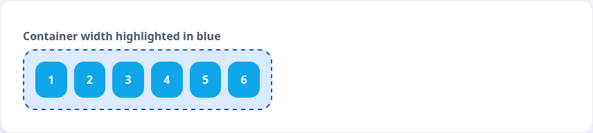
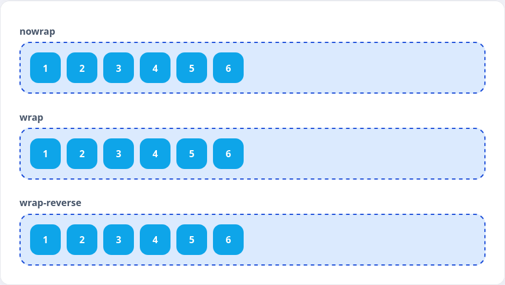

В прошлых примерах использовалось довольно мало элементов внутри флекс-контейнера. Представим, что элементов больше и они не помещаются. В этом случае элементы продолжат располагаться вдоль главной оси и выйдут за пределы контейнера.

```html
<div class="wrap-stage wrap-stage--nowrap">
  <div class="wrap-chip">1</div>
  <div class="wrap-chip">2</div>
  <div class="wrap-chip">3</div>
  <div class="wrap-chip">4</div>
  <div class="wrap-chip">5</div>
  <div class="wrap-chip">6</div>
</div>
```

```css
.wrap-stage {
  display: flex;
  gap: 12px;
  width: 320px;
  padding: 12px;
  border: 2px dashed #1d4ed8;
  background: #dbeafe;
}

.wrap-stage--nowrap {
  flex-wrap: nowrap;
}

.wrap-chip {
  width: 48px;
  height: 48px;
  border-radius: 12px;
  background: #0ea5e9;
}
```



Чтобы контролировать перенос, используется свойство `flex-wrap`, которое принимает значения:

* `nowrap` — перенос отключен
* `wrap` — элементы переносятся, когда не хватает места
* `wrap-reverse` — перенос с инверсией порядка вдоль главной оси

```html
<div class="wrap-gallery">
  <div>
    <p class="wrap-label">nowrap</p>
    <div class="wrap-stage wrap-stage--nowrap">
      <div class="wrap-chip">1</div>
      <div class="wrap-chip">2</div>
      <div class="wrap-chip">3</div>
      <div class="wrap-chip">4</div>
      <div class="wrap-chip">5</div>
      <div class="wrap-chip">6</div>
    </div>
  </div>

  <div>
    <p class="wrap-label">wrap</p>
    <div class="wrap-stage wrap-stage--wrap">
      <div class="wrap-chip">1</div>
      <div class="wrap-chip">2</div>
      <div class="wrap-chip">3</div>
      <div class="wrap-chip">4</div>
      <div class="wrap-chip">5</div>
      <div class="wrap-chip">6</div>
    </div>
  </div>

  <div>
    <p class="wrap-label">wrap-reverse</p>
    <div class="wrap-stage wrap-stage--wrap-reverse">
      <div class="wrap-chip">1</div>
      <div class="wrap-chip">2</div>
      <div class="wrap-chip">3</div>
      <div class="wrap-chip">4</div>
      <div class="wrap-chip">5</div>
      <div class="wrap-chip">6</div>
    </div>
  </div>
</div>
```

```css
.wrap-gallery {
  display: flex;
  flex-direction: column;
  gap: 16px;
}

.wrap-label {
  margin: 0 0 6px;
  font-weight: 600;
}

.wrap-stage--wrap {
  flex-wrap: wrap;
}

.wrap-stage--wrap-reverse {
  flex-wrap: wrap-reverse;
}
```


