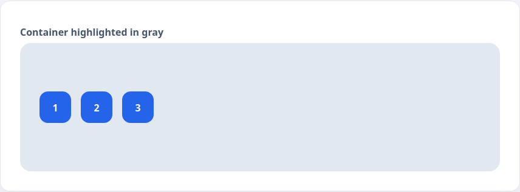
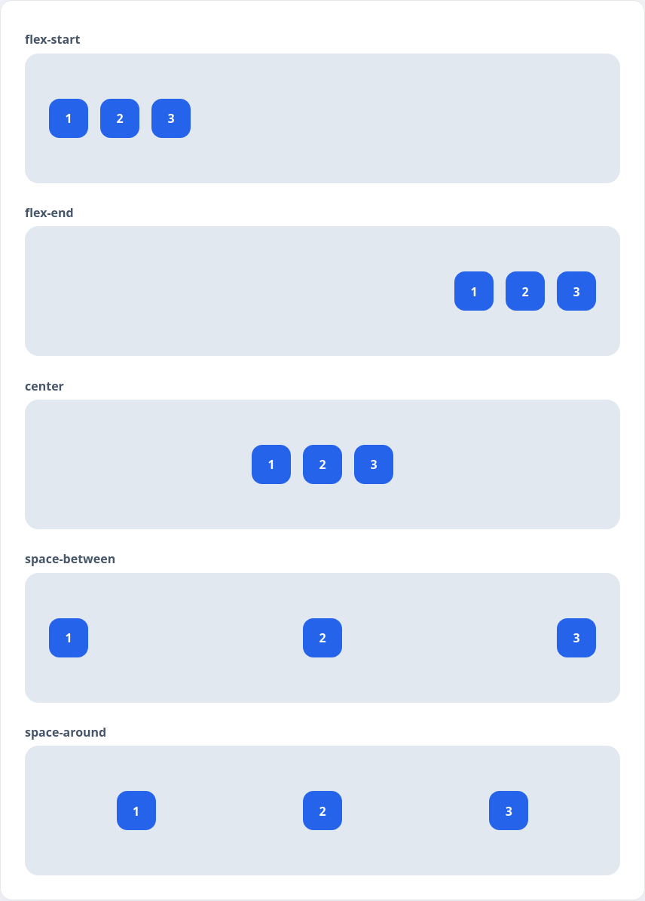
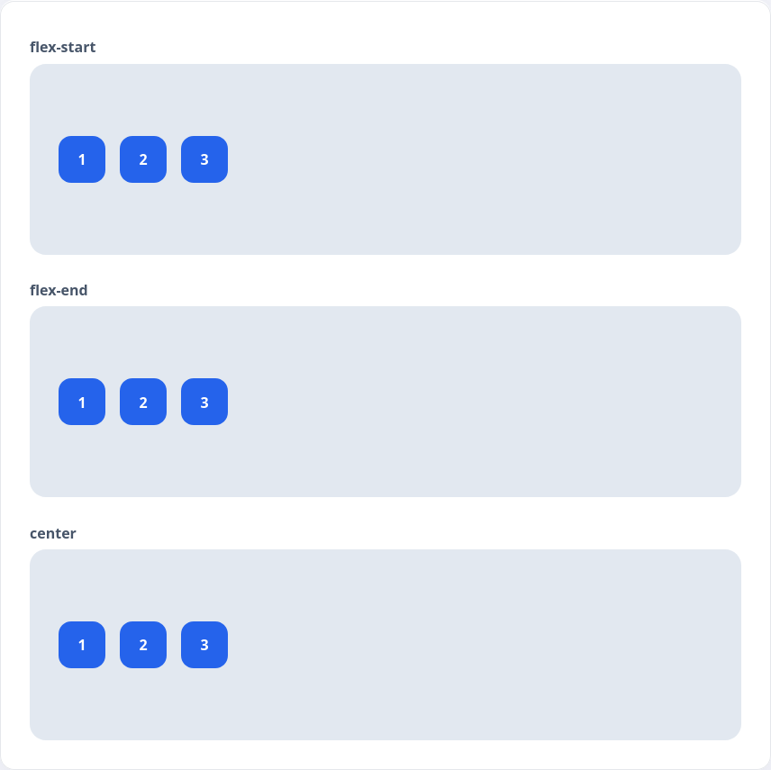
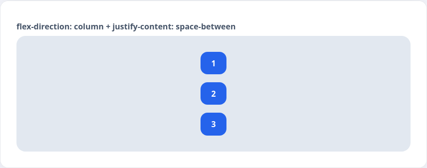

Одна из сильных сторон Flex — возможность выравнивать элементы по любому из двух осей. В этой лекции рассмотрим, как `justify-content` распределяет элементы вдоль главной оси, а `align-items` — вдоль побочной.

```html
<div class="alignment-stage">
  <div class="alignment-item">1</div>
  <div class="alignment-item">2</div>
  <div class="alignment-item">3</div>
</div>
```

```css
.alignment-stage {
  display: flex;
  gap: 12px;
  height: 200px;
  padding: 24px;
  border-radius: 16px;
  background: rgba(148, 163, 184, 0.35);
}

.alignment-item {
  width: 52px;
  height: 52px;
  border-radius: 12px;
  background: #fbbf24;
  font-weight: 600;
  display: flex;
  align-items: center;
  justify-content: center;
}
```



## Выравнивание по главной оси

`justify-content` управляет положением элементов вдоль главной оси (по горизонтали, если задано `flex-direction: row`).

```html
<div class="justify-gallery">
  <div>
    <p class="alignment-label">flex-start</p>
    <div class="alignment-stage alignment-stage--justify-start">
      <div class="alignment-item">1</div>
      <div class="alignment-item">2</div>
      <div class="alignment-item">3</div>
    </div>
  </div>
  <div>
    <p class="alignment-label">flex-end</p>
    <div class="alignment-stage alignment-stage--justify-end">
      <div class="alignment-item">1</div>
      <div class="alignment-item">2</div>
      <div class="alignment-item">3</div>
    </div>
  </div>
  <div>
    <p class="alignment-label">center</p>
    <div class="alignment-stage alignment-stage--justify-center">
      <div class="alignment-item">1</div>
      <div class="alignment-item">2</div>
      <div class="alignment-item">3</div>
    </div>
  </div>
  <div>
    <p class="alignment-label">space-between</p>
    <div class="alignment-stage alignment-stage--justify-between">
      <div class="alignment-item">1</div>
      <div class="alignment-item">2</div>
      <div class="alignment-item">3</div>
    </div>
  </div>
  <div>
    <p class="alignment-label">space-around</p>
    <div class="alignment-stage alignment-stage--justify-around">
      <div class="alignment-item">1</div>
      <div class="alignment-item">2</div>
      <div class="alignment-item">3</div>
    </div>
  </div>
</div>
```

```css
.justify-gallery {
  display: grid;
  gap: 16px;
}

.alignment-label {
  margin: 0 0 6px;
  font-weight: 600;
}

.alignment-stage--justify-start {
  justify-content: flex-start;
}

.alignment-stage--justify-end {
  justify-content: flex-end;
}

.alignment-stage--justify-center {
  justify-content: center;
}

.alignment-stage--justify-between {
  justify-content: space-between;
}

.alignment-stage--justify-around {
  justify-content: space-around;
}
```



## Выравнивание по побочной оси

`align-items` отвечает за положение элементов на перпендикулярной оси. При стандартном направлении это вертикальное выравнивание.

```html
<div class="align-gallery">
  <div>
    <p class="alignment-label">flex-start</p>
    <div class="alignment-stage alignment-stage--align-start">
      <div class="alignment-item">1</div>
      <div class="alignment-item">2</div>
      <div class="alignment-item">3</div>
    </div>
  </div>
  <div>
    <p class="alignment-label">flex-end</p>
    <div class="alignment-stage alignment-stage--align-end">
      <div class="alignment-item">1</div>
      <div class="alignment-item">2</div>
      <div class="alignment-item">3</div>
    </div>
  </div>
  <div>
    <p class="alignment-label">center</p>
    <div class="alignment-stage alignment-stage--align-center">
      <div class="alignment-item">1</div>
      <div class="alignment-item">2</div>
      <div class="alignment-item">3</div>
    </div>
  </div>
</div>
```

```css
.align-gallery {
  display: grid;
  gap: 16px;
}

.alignment-stage--align-start {
  align-items: flex-start;
}

.alignment-stage--align-end {
  align-items: flex-end;
}

.alignment-stage--align-center {
  align-items: center;
}
```



Если поменять направление оси с помощью `flex-direction: column`, то `justify-content` начнёт распределять элементы по вертикали.

```html
<div class="alignment-stage alignment-stage--column">
  <div class="alignment-item">1</div>
  <div class="alignment-item">2</div>
  <div class="alignment-item">3</div>
</div>
```

```css
.alignment-stage--column {
  flex-direction: column;
  justify-content: space-between;
}
```


