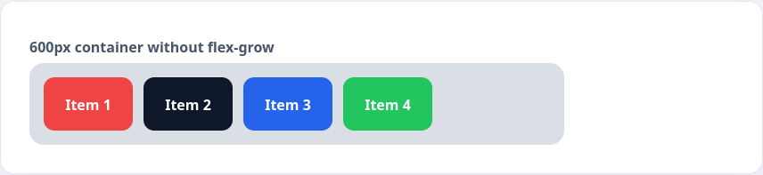
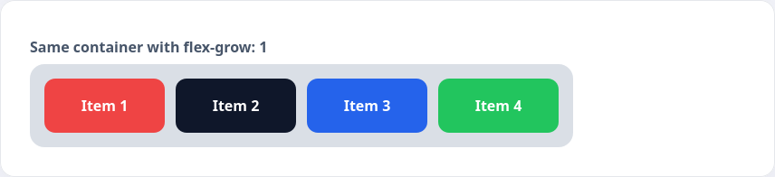

Flex дал разработчикам главное преимущество — элементы могут автоматически подстраиваться под свободное пространство. За это отвечают две свойства:

1. `flex-grow` — какую долю свободного пространства получит элемент
2. `flex-shrink` — насколько элемент может уменьшиться при нехватке места

Чаще всего достаточно значений `0` или `1`, чтобы распределять ширину без сложных формул.

```html
<div class="items-track">
  <div class="items-chip chip-red">Item 1</div>
  <div class="items-chip chip-dark">Item 2</div>
  <div class="items-chip chip-blue">Item 3</div>
  <div class="items-chip chip-green">Item 4</div>
</div>
```

```css
.items-track {
  display: flex;
  gap: 12px;
  width: 600px;
  padding: 16px;
  border-radius: 16px;
  background: rgba(148, 163, 184, 0.35);
}

.items-chip {
  width: 100px;
  height: 50px;
  border-radius: 12px;
  color: #fff;
  font-weight: 600;
  display: flex;
  align-items: center;
  justify-content: center;
}

.chip-red { background: #ef4444; }
.chip-dark { background: #0f172a; }
.chip-blue { background: #2563eb; }
.chip-green { background: #22c55e; }
```



Если добавить `flex-grow: 1` всем элементам, оставшееся пространство делится поровну.

```css
.items-chip {
  flex-grow: 1;
}
```



Можно задать `flex-grow: 1` только одному элементу — тогда он займёт весь свободный участок, а соседи сохранят исходную ширину. Свойство `flex-shrink` работает аналогично, но в обратную сторону: при значении `1` элементы будут уменьшаться пропорционально, если контейнеру не хватает места.
