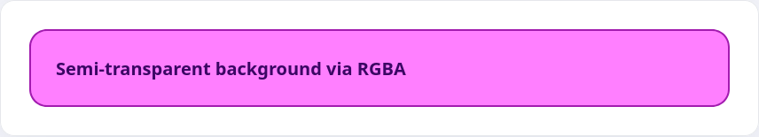

В ходе курса мы уже сталкивались со свойствами, которые принимают цветовые значения (`color`, `background-color`, `border-color`). Чаще всего цвета задаются в RGB — либо в шестнадцатерной записи, либо через функцию `rgb()`.

## Шестнадцатеричная запись

HEX делит цвет на три блока по два символа (`#rrggbb`). Каждый блок описывает интенсивность красного, зелёного или синего в диапазоне от `00` до `ff`.

```html
<p class="color-hex">Magenta text rendered via HEX</p>
```

```css
.color-hex {
  color: #ff00ff;
}
```


## Функция rgb()

`rgb()` работает так же, но использует обычные числа от 0 до 255.

```html
<p class="color-rgb">Magenta text rendered via rgb()</p>
```

```css
.color-rgb {
  color: rgb(255, 0, 255);
}
```


## Прозрачность и rgba()

Для задания прозрачного фона используется дополнительный параметр — альфа-канал.

```html
<div class="background-demo">Semi-transparent magenta background</div>
```

```css
.background-demo {
  background-color: rgba(255, 0, 255, 0.5);
  color: #3b0764;
  padding: 16px;
  border-radius: 12px;
  font-weight: 600;
}
```


