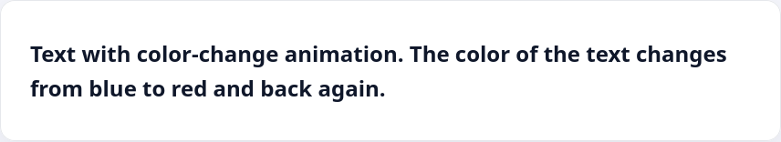

Animation is an extensive module in CSS. Unfortunately, it's impossible to describe all the features in one lesson. In this lesson, we will show you the basic principle of animation in CSS based on `@keyframes`. For example, let's make a text animation, where the color of the text changes from blue to red.

The `@keyframes` rule and the name of the animation will be used to set the animation:

```css
@keyframes color-change {
  // Inside will be our animation
}
```

The name of the animation can be anything. You can choose it yourself. After, the `animation` property will know which animation you want to play by its name.

Inside `@keyframes` you need to specify different time intervals in which the changes will take place. For example, at the start (0% animation completion), there should be blue text, in the middle of the animation (50%), it should become red, and at the end (100%) it'll go back to blue.

```css
@keyframes color-change {
  0% {
    color: blue;
  }

  50% {
    color: red;
  }

  100% {
    color: blue;
  }
}
```

Now we need to apply the animation we created to the text on the page. To accomplish this, use the `animation` rule with three basic values:

* Animation name
* Length of the animation. It's given in seconds (1s, 2s, 3s etc.)
* You also need to decide if the animation will be infinite (if it is infinite, then you need to specify the infinite parameter)

```css
.animation-text {
  animation: color-change 3s infinite;
}
```

All that's left is to create a paragraph with the necessary class, and the animation will begin to work.

```html
<p class="animation-text">Text with color-change animation. The color of the text changes from blue to red and back again</p>
```


